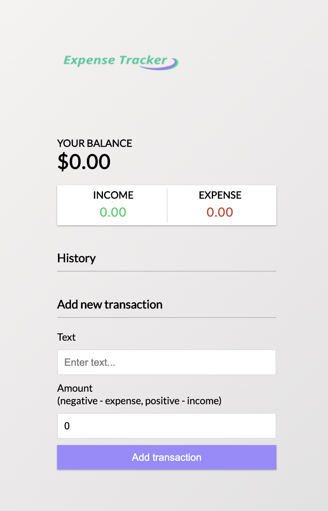
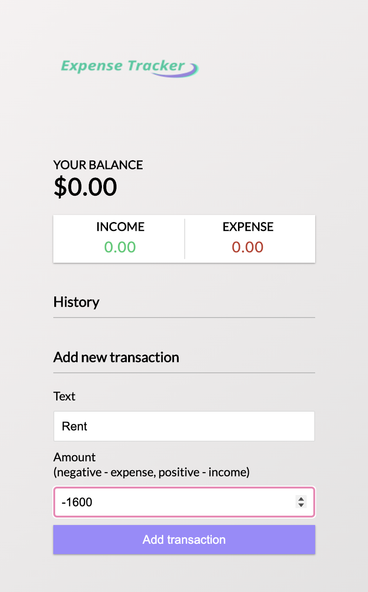
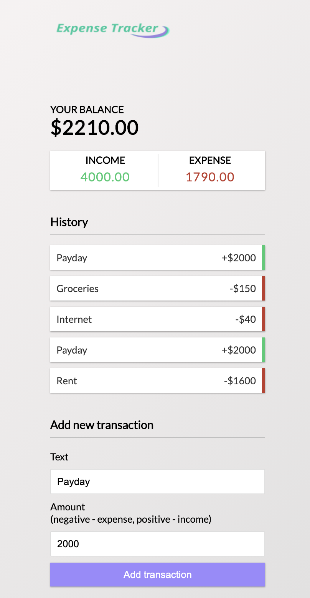

# Expense Tracker

### This is a small React project using Components, Hooks and the Context API

#### The Stack
* React
* Context API
* React Hooks

#### This is a small expense tracker app that allowed myself to learn more about React Hooks as well as learning about the Context API.

